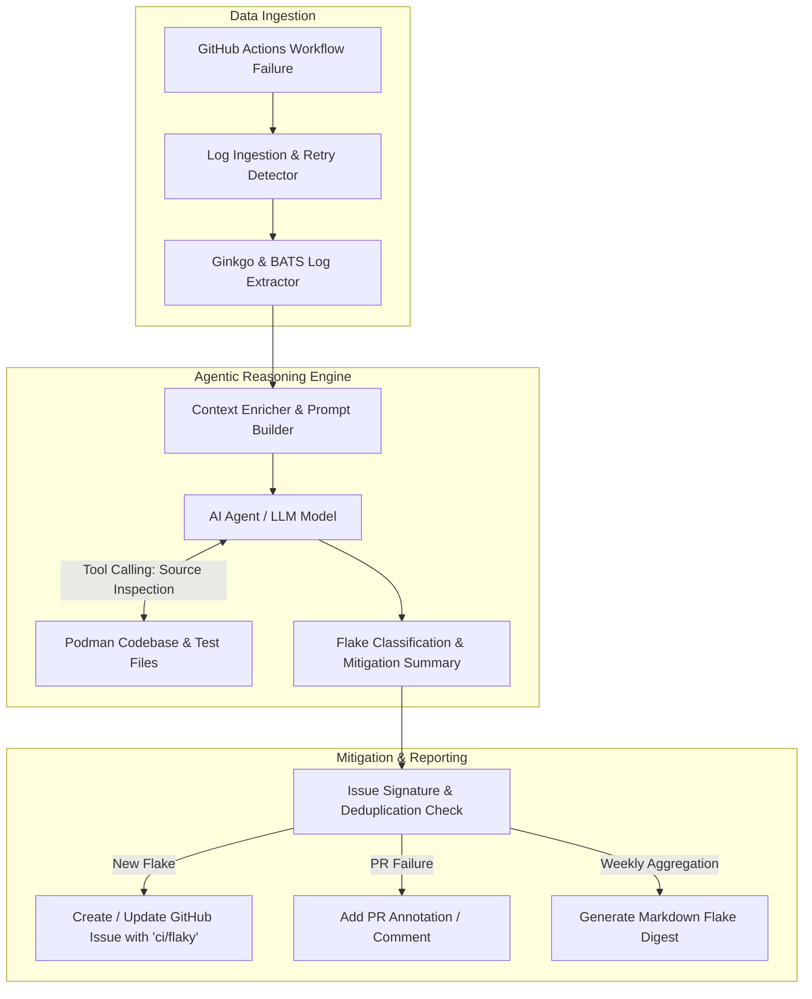

# LFX Mentorship Proposal: Automated Flaky Test Analysis & Reporting Toolchain using Agentic AI

**Project Title**: Automated Flaky Test Analysis & Reporting Toolchain using Agentic AI  
**Target Organization**: Podman (`containers/podman`)  
**Mentors**: Paul Holzinger (@Luap99), Tim Zhou (@timcoding1988), Mohan Boddu (@mohanboddu)  

---

## 1. Abstract & Problem Statement

Continuous Integration (CI) pipelines in `containers/podman` execute thousands of test cases across diverse environments (root vs. rootless, local ABI vs. remote tunnel, Linux distributions, Cgroups v1/v2). However, **"flaky" tests**—tests that fail intermittently due to race conditions, timeouts, resource exhaustion, or infrastructure blips rather than actual code regressions—significantly slow down developer velocity and increase triage overhead for maintainers.

Currently, maintainers must manually navigate lengthy GitHub Actions run logs, parse raw standard output/error, determine whether a failure is a genuine bug or a flake, and manually track recurring flaky tests.

This project will build an automated **Agentic AI Toolchain** that:
1. Automatically ingests GitHub Actions CI failure logs from `containers/podman`.
2. Extracts and structures failure details from Podman's primary test frameworks (Ginkgo E2E and BATS System tests).
3. Employs an **Agentic AI Workflow** to categorize the root cause of the flake (e.g., race condition, network/registry timeout, runner infrastructure error, state leak) and suggest concrete fixes.
4. Integrates seamlessly into the maintainer workflow via automated GitHub Issues, PR annotations, and weekly flaky test summary reports.

---

## 2. Proposed Architecture & Solution Design



### Key Technical Modules

#### Module 1: Data Ingestion & Retry Pipeline
- **API Client**: Built using Python (`httpx` / `PyGithub`) or Go (`google/go-github`).
- **Trigger Mechanisms**:
  - `workflow_run` event when `.github/workflows/ci.yml` completes with a failure.
  - Scheduled run (e.g. daily/weekly digest).
  - On-demand CLI command for maintainers (`hack/ci/analyze-flake --run-id <ID>`).
- **Retry Detection**: Compares attempt 1 failure logs against attempt 2 pass logs to mathematically confirm flaky behavior.

#### Module 2: Specialized Log Parsers for Podman Test Suites
- **Ginkgo E2E Parser** (`test/e2e/`):
  - Extracts failed spec description (`[It] ...`).
  - Isolates exact source location (`filename.go:line`).
  - Captures assertion failures, panic traces, and container stdout/stderr.
- **BATS System Test Parser** (`test/system/`):
  - Extracts failed test name (`XXX-filename.bats`).
  - Extracts executed command line, return code `$status`, and `$output`.
- **System / Kernel Log Parser**:
  - Extracts audit and journal logs collected by `hack/ci/logcollector.sh`.

#### Module 3: Agentic Reasoning & Categorization Engine
- **Taxonomy of Flakiness**:
  - **Category A: Infrastructure / Runner Flake**: Disk space exhaustion, runner agent disconnection, kernel panic.
  - **Category B: Race Condition / Timing**: Goroutine leak, file lock contention, asynchronous container startup delay.
  - **Category C: Network / Registry Timeout**: Rate limiting from image registries (e.g., `quay.io`), `netavark` / `aardvark-dns` setup timeout.
  - **Category D: State Leakage / Environment Residuals**: Uncleaned cgroups, leftover podman pods/containers from prior test cases.
- **Agent Capabilities**:
  - **Prompt Engineering**: System prompt structured with strict JSON output schemas and domain context (root vs. rootless, ABI vs. tunnel).
  - **Tool Calling**: Allows the agent to inspect source files (e.g., reading the test file referenced in the Ginkgo stack trace) to give precise mitigation advice.

#### Module 4: Deduplication & GitHub Reporting
- **Signature Hashing**: Hashing `hash(test_suite + test_name + normalized_error_string)` to uniquely identify flaky tests.
- **GitHub Integration**:
  - Auto-files GitHub Issues labeled `ci/flaky` with stack trace, AI analysis, and suggested fix.
  - Updates existing issue if the flake signature recurs, tracking frequency over time.
  - Posts PR comments with context when a PR CI run fails due to a known flake.

---

## 3. Where Changes Will Be Made in the Codebase

The implementation will be modular, lightweight, and cleanly integrated into the existing `containers/podman` repository structure without altering core engine binaries.

```text
podman/
├── .github/
│   └── workflows/
│       └── flaky-test-analyzer.yml   # [NEW] Workflow for automated analysis & reporting
├── hack/
│   └── ci/
│       ├── flaky-analyzer/            # [NEW] Core toolchain directory
│       │   ├── ingestion/             # GitHub API log fetcher & retry detector
│       │   ├── parsers/               # Ginkgo, BATS, & journal log parsers
│       │   ├── agent/                 # LLM client, prompts, and tool-calling engine
│       │   ├── reporter/              # Deduplication engine & GitHub API reporter
│       │   └── main.py (or main.go)   # CLI entry point
│       └── analyze-ci-flake           # [NEW] Shell wrapper script for maintainers
└── docs/
    └── source/
        └── markdown/
            └── podman-flaky-analyzer.1.md # [NEW] Man page & documentation for maintainers
```

### Detailed File Changes

| File / Path | Action | Description |
| :--- | :--- | :--- |
| `hack/ci/flaky-analyzer/ingestion/` | **[NEW]** | GitHub API integration to pull workflow run metadata, jobs, step logs, and retry attempts. |
| `hack/ci/flaky-analyzer/parsers/` | **[NEW]** | Log parsing routines for Ginkgo E2E (`test/e2e/`), BATS (`test/system/`), and unit tests. |
| `hack/ci/flaky-analyzer/agent/` | **[NEW]** | Prompt templates, LLM API client (OpenAI/Anthropic/Local LLM support), and agentic tool-calling routines. |
| `hack/ci/flaky-analyzer/reporter/` | **[NEW]** | Deduplication engine using signature hashing + GitHub Issue/PR annotation creators. |
| `hack/ci/analyze-ci-flake` | **[NEW]** | Maintainer CLI script to analyze any GitHub Actions run ID on demand. |
| `.github/workflows/flaky-test-analyzer.yml` | **[NEW]** | Scheduled and event-driven workflow that runs the analyzer on failed CI runs. |
| `docs/source/markdown/` | **[NEW]** | Comprehensive documentation detailing setup, prompt customization, and deployment. |

---

## 4. Implementation Plan & Milestones

### Milestone 1: Data Ingestion & Parser Development (Weeks 1–3)
- Build API client to fetch workflow runs and job logs from `containers/podman`.
- Implement log parsers for Ginkgo E2E test failures and BATS system test failures.
- Implement retry detection logic (comparing attempt 1 vs attempt 2).
- **Deliverable**: CLI script that accepts a GitHub Actions run ID and outputs parsed JSON failure data.

### Milestone 2: Agentic Reasoning & Categorization Engine (Weeks 4–6)
- Define taxonomy categories and create structured prompt templates.
- Integrate LLM framework (e.g. LiteLLM / LangChain / custom agent loop with tool-calling capabilities).
- Enable agent tool calling to read test source files from `test/e2e/` or `test/system/`.
- **Deliverable**: Agentic engine that converts parsed failure JSON into root-cause categorization + plain-English mitigation report.

### Milestone 3: Deduplication & GitHub Workflow Integration (Weeks 7–9)
- Build failure signature hashing logic to prevent duplicate issue creation.
- Implement GitHub API integration for filing/updating issues with label `ci/flaky`.
- Build PR commenter / annotation generator for active pull requests.
- **Deliverable**: End-to-end automated pipeline executing locally and reporting to GitHub.

### Milestone 4: CI Automation, Documentation & Maintainer Review (Weeks 10–12)
- Create `.github/workflows/flaky-test-analyzer.yml` for automated repository integration.
- Write documentation on how maintainers can customize prompts, adjust thresholds, and run local analyses.
- Present final results, write unit & integration tests for the toolchain, and submit upstream PR to `containers/podman`.
- **Deliverable**: Complete, upstream-merged toolchain with docs and tests.

---

## 5. Verification & Quality Assurance

To ensure reliability and maintainability:
- **Unit Testing**: Unit tests for all log parsers and signature hashing functions.
- **API Mocking**: Mocking GitHub API and LLM responses to test the pipeline deterministically.
- **Validation Dataset**: Testing the toolchain against a curated historical dataset of 50+ real Podman CI failures.
- **Linters & Formatting**: Code strictly adhering to repository standards (`gofumpt` / `black` / `flake8`).

---

## 6. Why Me / Relevant Skills

- **Languages & Scripting**: Proficient in Python and Go, with experience interacting with REST & GraphQL APIs.
- **CI/CD & Testing**: Strong understanding of GitHub Actions workflows, Ginkgo E2E, and shell/BATS testing.
- **AI & Agentic Systems**: Practical experience with LLM API integrations, prompt engineering, structured output schemas, and agentic tool-calling.
