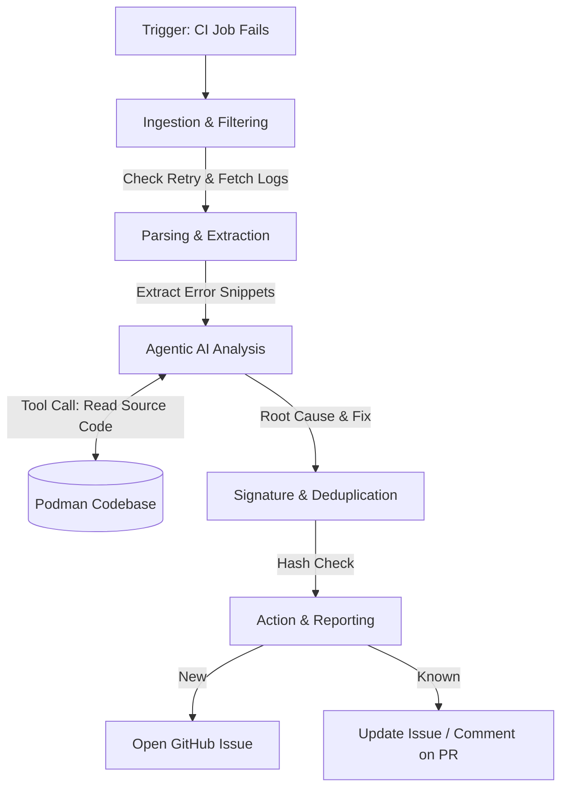

# Architecture & Implementation Proposal
**Project:** Automated Flaky Test Analysis & Reporting Toolchain using Agentic AI
**Target:** Podman (`containers/podman`)

---

## 1. Problem Statement & Objective
Podman runs thousands of tests across complex CI environments (GitHub Actions). When tests fail intermittently due to race conditions, timeouts, or infrastructure issues (flaky tests), maintainers must manually parse 50,000-line logs to diagnose the issue. 

**Objective:** Build an automated toolchain that ingests CI failure logs, filters out the noise, uses an Agentic AI LLM to deduce the root cause, and automatically reports actionable fixes via GitHub Issues and PR comments.

---

## 2. High-Level Architecture Flow

The system operates in a 6-stage pipeline:

---

## 3. Step-by-Step Execution Flow

1. **Trigger Phase:** 
   - A `workflow_run` event is triggered when Podman's primary `ci.yml` pipeline fails. Our analyzer workflow wakes up.
2. **Ingestion & Filtering Phase:** 
   - Uses the GitHub REST API to fetch job metadata. 
   - Identifies if a job failed on Attempt 1 but passed on Attempt 2 (proving it is a flake, not a hard breakage).
   - Downloads the raw job `.zip` logs.
3. **Parsing & Extraction Phase:** 
   - Raw logs are routed to custom parsers.
   - **Ginkgo Parser:** Extracts `[It]` spec names, source file/line numbers (e.g. `network_test.go:45`), and stack traces from E2E tests.
   - **BATS Parser:** Extracts failed `.bats` filenames, exact failing shell commands, and exit codes from System tests.
4. **Agentic Analysis Phase:** 
   - The extracted, noise-free error snippet is injected into a strict LLM system prompt.
   - The AI Agent categorizes the flake (e.g., *Network Timeout, Race Condition, Infra Blip, State Leak*).
   - The Agent generates a plain-English explanation and a suggested code fix.
5. **Deduplication Phase:** 
   - Generates a unique fingerprint: `SHA256_HASH(Test_Name + Core_Error_String)`.
   - Queries Podman's GitHub Issues via API to see if this flake is already being tracked.
6. **Action & Reporting Phase:** 
   - **New Flake:** Auto-creates an Issue labeled `ci/flaky` with the AI diagnosis.
   - **Known Flake:** Updates the existing Issue's occurrence counter.
   - **PR Failure:** Leaves a PR review comment notifying the author that the failure is a known flake and unrelated to their code.

---

## 4. How I Am Going To Make It (Implementation Strategy)

### Tech Stack
*   **Language:** Python 3.10+ (or Go, aligned with Podman's ecosystem).
*   **APIs:** `PyGithub` (or `google/go-github`) for GitHub REST API interaction.
*   **AI/LLM Framework:** `LiteLLM` or raw `OpenAI/Anthropic` SDKs for agentic reasoning and strict JSON schema output.

### Codebase Integration Points
The toolchain will be lightweight and isolated. I will make changes in the following locations within `containers/podman`:

1.  **Core Toolchain Directory:** `hack/ci/flaky-analyzer/`
    *   `/ingestion/`: API scripts to fetch logs and check retry states.
    *   `/parsers/`: Regex and string-manipulation logic for Ginkgo/BATS.
    *   `/agent/`: LLM prompt templates and tool-calling definitions.
    *   `/reporter/`: Signature hashing and GitHub Issue creator.
2.  **Maintainer CLI:** `hack/ci/analyze-ci-flake.py`
    *   A command-line wrapper allowing maintainers to run the analyzer locally on demand (e.g., `python analyze-ci-flake.py --run-id 12345`).
3.  **CI Automation:** `.github/workflows/flaky-test-analyzer.yml`
    *   The GitHub Actions YAML that wires the toolchain to run automatically in the cloud.
